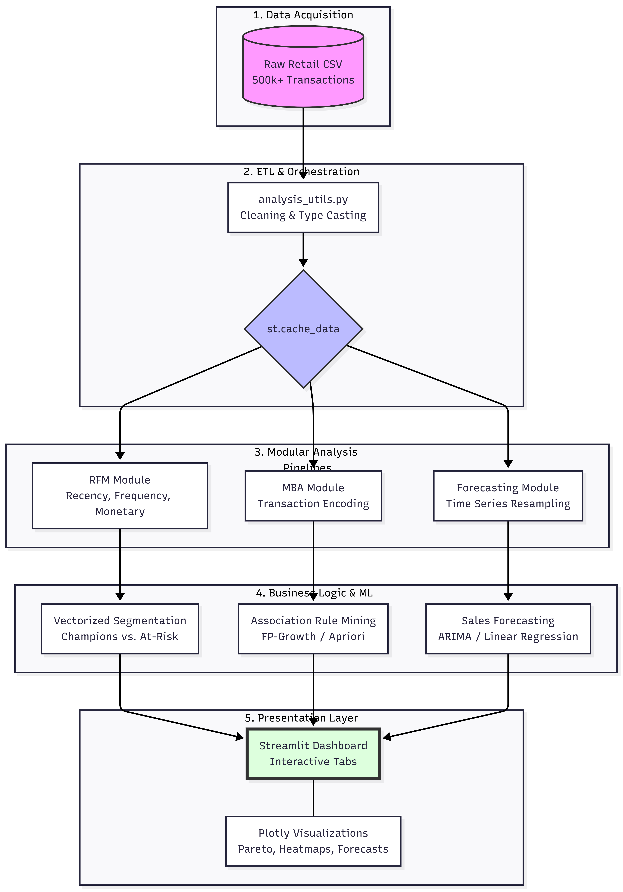

# 🛍️ Retail Sales Forecasting and Customer Segmentation

## 📌 Project Overview

This project analyzes **1 year of transactional retail data** to uncover customer behavior, product insights, and sales forecasting patterns.

📊 **Dataset Source:**  
UCI Machine Learning Repository – Online Retail II  
https://archive.ics.uci.edu/dataset/502/online+retail+ii

### Dataset Features
- Invoice No  
- Invoice Date 
- Product Description  
- Quantity  
- Unit Price  
- Customer ID  
- Country  

---

# 🔎 1️⃣ Exploratory Data Analysis (EDA)

Performed data cleaning, feature engineering, and aggregation to understand overall business performance.

### 📊 Key Visual Insights
- Top Cancelled Products  
- Most & Least Sold Products (by Quantity)  
- Most & Least Revenue Generating Products  
- Monthly Revenue Trend  

These insights revealed seasonality patterns, revenue drivers, and underperforming SKUs.

---

# 👥 2️⃣ RFM Analysis (Customer Segmentation)

Engineered customer-level features:

- Recency  
- Frequency  
- Monetary  
- Recency_reversed  
- R, F, M Scores (1–5 quantiles)  
- Final RFM Score  
- Segments: Champions, Loyal, At Risk, etc.

### 📈 RFM Visualizations
- RFM Scores by Customer Count  
- Customers per Segment  
- Revenue Contribution per Segment  

### 💡 Major Business Insight

Classic **Pareto Principle (80/20 rule)** scenario:

- Champions = 25% of customers  
- Contribute = 66% of total revenue  

Retail business is heavily dependent on a small elite group. Retaining these high-value customers is critical.

---

# 🛒 3️⃣ Market Basket Analysis (MBA)

Performed association rule mining after transaction-level feature engineering.

### Algorithms Used
- Apriori  
- FP-Growth  

### 🔍 Apriori Insight
Customers who buy "WOODEN PICTURE FRAME WHITE FINISH"  
are 14× more likely to also buy  
"WOODEN FRAME ANTIQUE WHITE".

### 🔥 FP-Growth Insights
- Strong associations at 1% support  
- Lift up to 65  
- 79.9% of Playhouse Kitchen buyers also bought Bedroom  
- FP-Growth handled lower support better (Apriori had memory constraints)

FP-Growth uncovered powerful niche product bundles.

---

# 📈 4️⃣ Time Series Forecasting (Daily Level)

Aggregated sales at day level and forecasted the last 45 days, validating predictions against actual values.

### Models Used
- ARIMA (with Auto-ARIMA tuning)  
- Linear Regression (trend)

### 📊 Model Performance

Linear Regression  
- MAE: 21828.51  
- RMSE: 26316.89  

Tuned ARIMA  
- MAE: 21082.86  
- RMSE: 26892.57  

### ⚠️ Observations
Higher forecast errors due to:
- Short 1-year dataset  
- Holiday spikes  
- Weekly store closures  
- High volatility  

ARIMA slightly better on MAE; Linear Regression slightly better on RMSE.

---

# 🧠 Project Highlights

✔ End-to-end retail analytics  
✔ Customer segmentation using RFM  
✔ Association rule mining for bundling strategy  
✔ Forecasting comparison (ARIMA vs Linear Regression)  
✔ Business-focused insights  

---

# Project Structure

```text
├── data/                       # Contains raw retail data
├── src/
│   ├── association_rule_mining/
│   │   ├── model_apriori.py    # Apriori algorithm logic
│   │   ├── model_fpgrowth.py   # FP-Growth algorithm logic
│   │   └── preprocess_mba.py   # Encoding for Market Basket Analysis
│   ├── forecasting/
│   │   ├── model_arima.py      # ARIMA Time Series modeling
│   │   ├── model_linear.py     # Linear Regression forecasting
│   │   └── preprocess_ts.py    # Time series data preparation
│   ├── initial_eda/
│   │   ├── analysis_utils.py   # General analysis helper functions
│   │   └── preprocessing.py    # Initial data cleaning and ETL
│   ├── rfm/
│   │   └── preprocess_rfm.py   # RFM Scoring and Segmentation logic
│   ├── dataload.py             # Central data loading module
│   └── plots_utils.py          # Unified Plotly visualization functions
├── main.py                     # Streamlit application entry point
```

---

# Getting Started

1. **Installation:** 
Clone the repository and install the required dependencies:
- git clone https://github.com/bawamehar/Retail-Sales-Forecasting-and-Customer-Segmentation
- pip install -r requirements.txt

2. **Execution:** 
Launch the Streamlit dashboard:
- streamlit run main.py

---

# 🚀 Final Takeaway

Retail revenue is highly concentrated among top customers, and strong product bundling opportunities exist within niche segments.  

Combining segmentation, market basket analysis, and forecasting provides a powerful decision-support framework for retail businesses.

---

# 📌 Conclusion

This project demonstrates: - Strong data preprocessing skills - Time
series modeling (ARIMA & Regression) - Feature engineering - Customer
segmentation using RFM - Model evaluation and comparison

It combines statistical modeling with business analytics to deliver
practical retail insights.

---

**UI**


**Architecture Diagram**



**Developed by Mehar Singh Bawa**
Retail Analytics | Data Science | Forecasting
